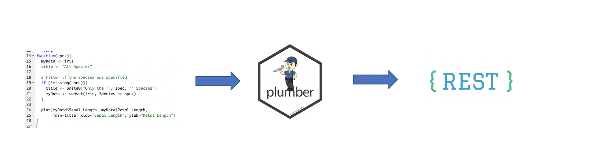
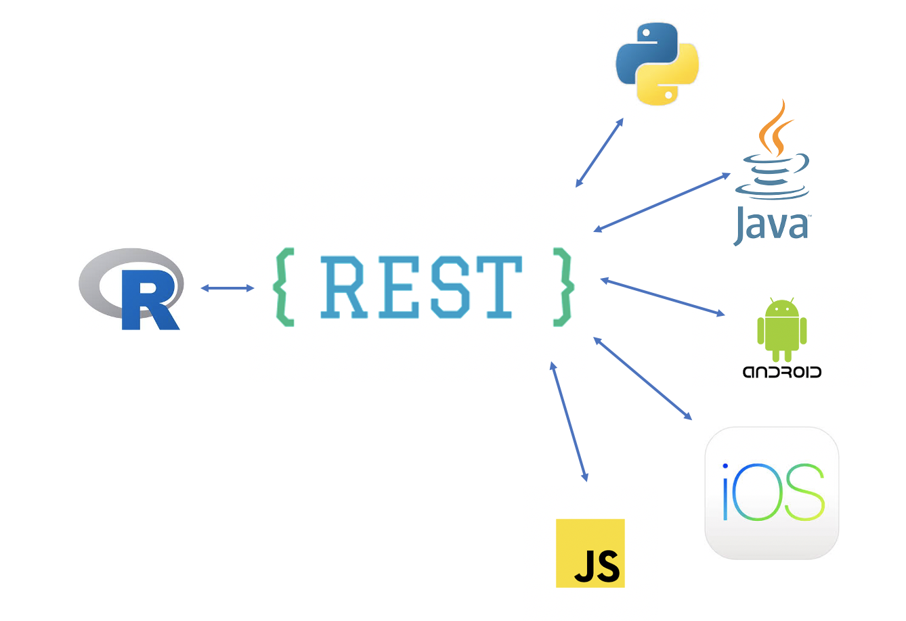
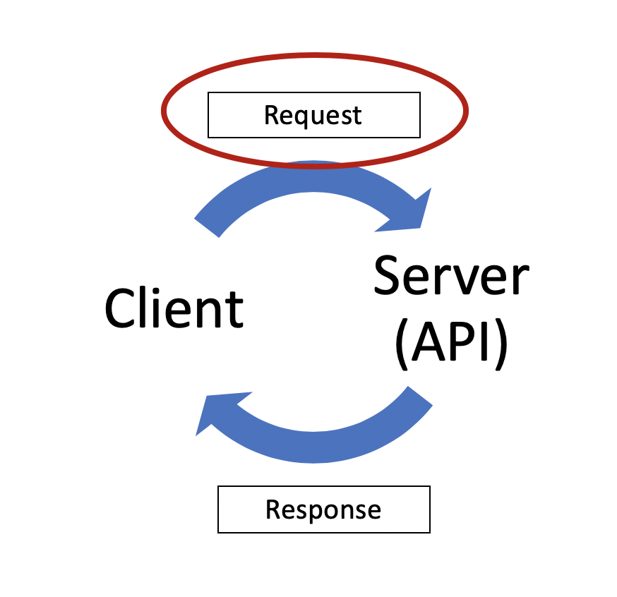
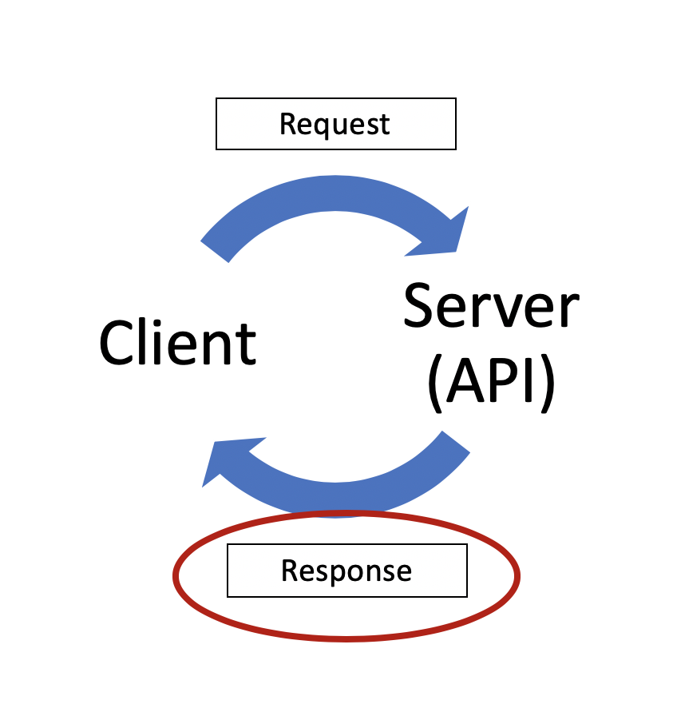
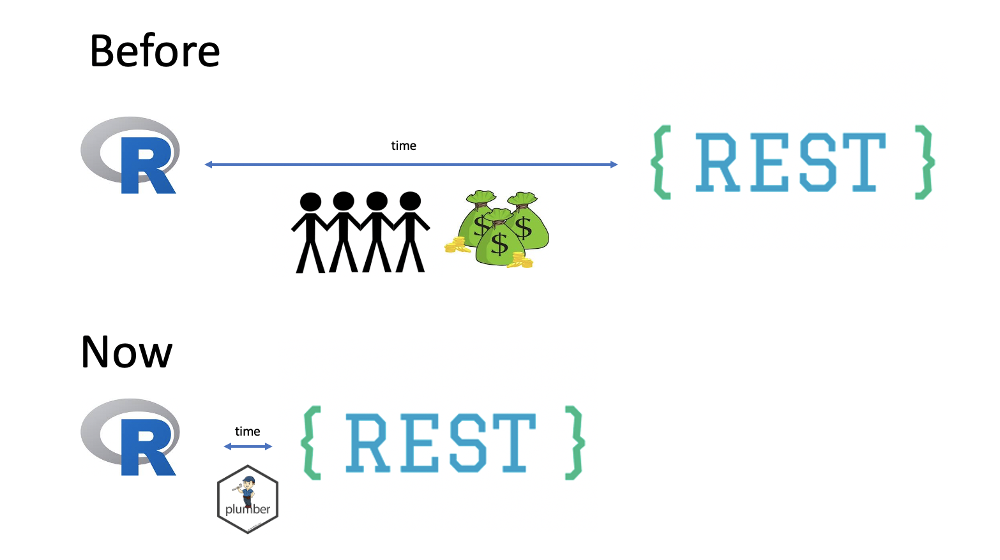

# Plumber Package
Convert your R code into a REST API!  

---
# APIs

- Stands for **Application Programming Interface**
- APIs are used to **transfer information** between applications/programs
- HTTP APIs have become the **predominant language** by which software communicates

???
"APIs are how weather forecast data is shared from a reputable source like the National Weather Service to hundreds of software apps that specialize in its presentation." Brenda Jin

---
# APIs provide a common interface other software can interact with

???
APIs give these systems a common language via a common interface
"IT org not set up to incorporate R models" - common challenge

---
# You call APIs by making "requests"  

.right-column[
**Requests are made up of:**
- a start line (mandatory)  
  - HTTP version (e.g. HTTP/1.1)
  - Method (e.g. GET, POST, PUT, DELETE)
  - API folder path
  - parameters
- headers (optional)
  - host name
  - token
- body (optional)

**How to make API calls in R:**  
`httr::GET(url, query = <list of query parameters>, ...)`
]

.left-column[

]

???
GET http://www.w3.org/pub/WWW/TheProject.html HTTP/1.1

https:://api-endpoint.org/api/rest_v1/resource_name?query1=value1&query2=value2

---
# ... and the API responds with a "response"  

.left-column[

]

.right-column[
API responses will most often be JSON or XML, standard formats for transferring information over the web.  

R, like other programming languages, has some great tooling for working with these standard data types.(e.g. `jsonlite::fromJSON(content(response, as = "text")))`
]

---
# Insurance data science teams are starting build a lot more APIs (with R)!
Some examples of what they are building include:

- APIs for 3rd parties like brokers & partners
- APIs to deploy models
  - Fraud detection models
  - Pricing models

???
"APIs can help make it easy for partners to do business with you. Providing APIs to an ecosystem of related services partners is an approach that is well-suited for generating new revenue streams." - [IBM Whitepaper\: Identifying API use cases\:
Property and casualty insurance](https://www.ibm.com/downloads/cas/XNMBM5BL)

---
# Plumber makes it easier, faster, and cheaper  

---
# Demo time!  
Follow these 5 steps to create your first Plumber API:
  1. write an R function
  2. install plumber
  3. add special comments
  4. test it / try it out
  5. deploy it

---
# Appendix    
- These slides were created with `rmarkdown` and `xaringan`. To learn more about the `xaringan` package, check out Alision's slides from her rstudio::conf 2019 workshop https://arm.rbind.io/slides/xaringan.html
