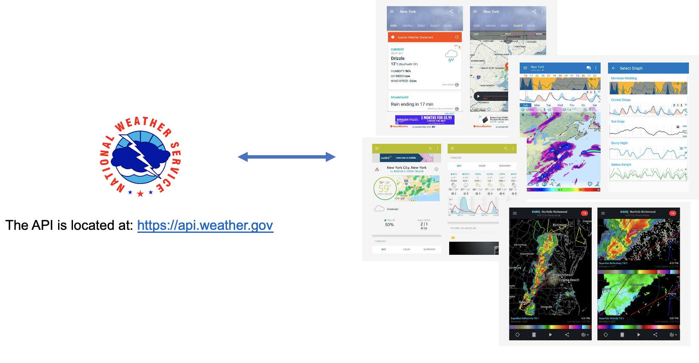

# Plumber
Plumber is an R package that makes it easy to transform your R functions into a REST API.

---
# APIs

- Stands for **Application Programming Interface**
- APIs are used to **transfer information** between applications/programs
- HTTP APIs have become the **predominant language** by which software communicates

???
"APIs are how weather forecast data is shared from a reputable source like the National Weather Service to hundreds of software apps that specialize in its presentation." Brenda Jin

---
# APIs in Insurance

---
class: center, middle

# Next slide  

Xarigan can align slides

---
background-image: url(https://www.akamai.com/uk/en/multimedia/images/video/akamai-api-video-thumbnail.jpg?imwidth=1366)
background-size: cover

---
# Learn Xarigan  
Slides from Alison's rstudio::conf 2019 workshop on Xarigan: https://arm.rbind.io/slides/xaringan.html#86
